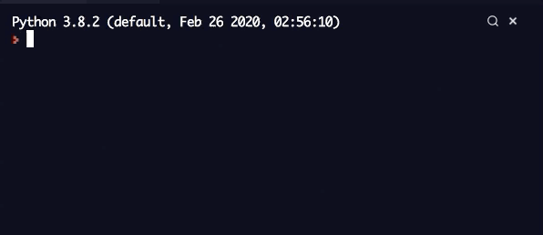

Day 2 - Understanding Data Types and How to Manipulate Strings

## Exercise

- https://replit.com/@AbisHussainHuss/day-02-01-Exercise#README.md
- https://replit.com/@AbisHussainHuss/day-02-02-Exercise#README.md
- https://replit.com/@AbisHussainHuss/day-02-03-Exercise#README.md

## Tip Calculator

https://replit.com/@AbisHussainHuss/Day-02-Project#readme.md
